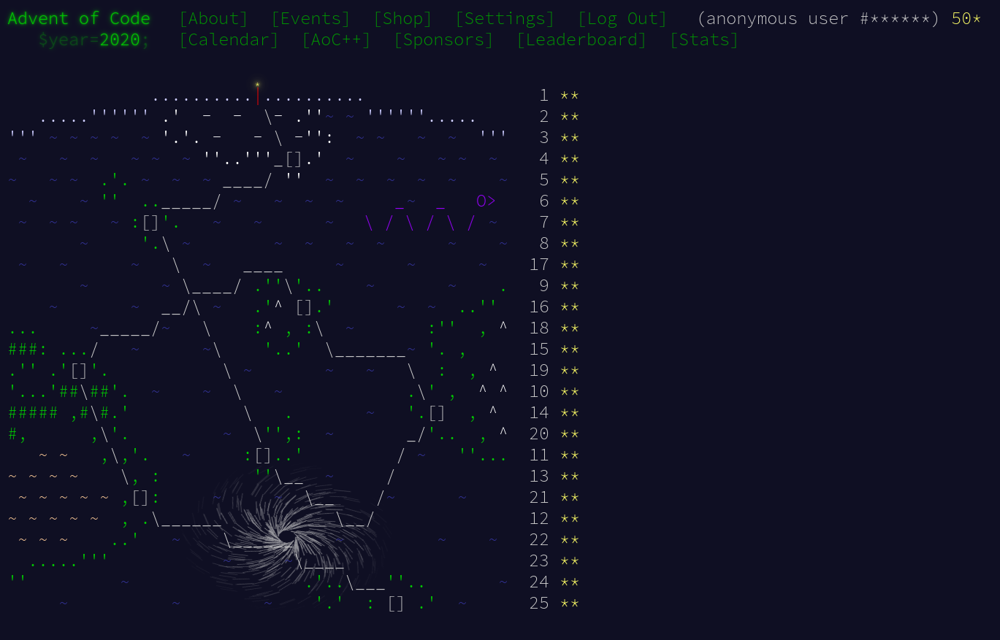

# Advent of Code 2020

**Author**: [Pratheek Nagaraj](https://www.pratheeknagaraj.com)

This repository contains my solutions for [Advent of Code 2020](https://adventofcode.com/2020)

## Language

All the solutions are in **Python3** (specific version used: `Python 3.7.9`)

## Info

Each day is listed in a independent subdirectory. Each subdirectory is listed as follows:

 - `*.py` contains solution code for parts **a** and **b**
 - `*_example*` contains example inputs given by the problem description for sanity checking
 - `*_input` contains the personalized input to be solved for in parts **a** and **b**
 - `*_out` contains the solutions for parts **a** and **b**

## Completion

Here's an image showing my completion of ***Advent of Code 2020***.

## License

See the [LICENSE file](LICENSE) in the same directory.
